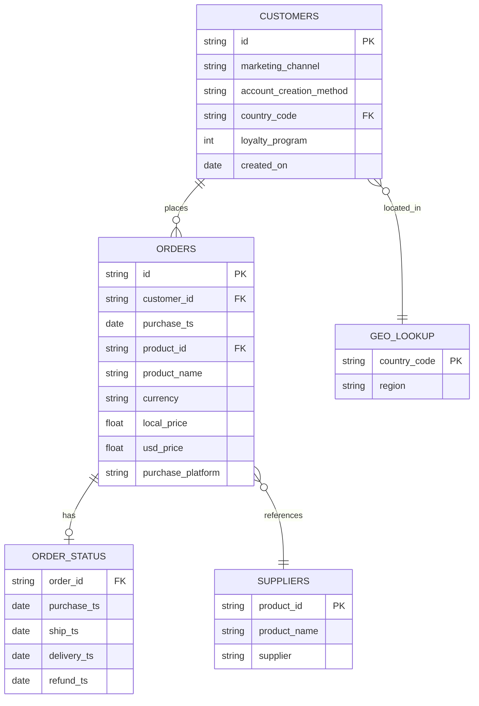

# E-commerce Order Analysis using excel

**Summary of Insights**

**Seasonality**

The data reveals a clear and repeatable seasonal pattern across 2020–2022. February and October are consistently the two weakest months of the year, averaging -20.7% and -34.9% month-over-month respectively. The October decline is worsening year over year from -23.9% in 2020, to -25.7% in 2021, to -55.2% in 2022, which suggests this isn't just a stable seasonal dip anymore but a trend worth investigating further.

March is a reliable recovery month, averaging +21.1% growth across the three years, largely offsetting the February slump. November and December consistently close out the year strong, averaging +16.9% and +24.5%, a clear holiday-driven sales lift present in every year of data. There's also a smaller, secondary dip in June (-5.4%, -4.8%, -10.8%), sitting between the early-year slump and the fall buildup, worth keeping an eye on even though it's less severe than Feb/Oct.

Put together, the annual rhythm looks like: strong Nov/Dec → sharp Jan/Feb drop → March rebound → gradual climb through summer → soft June → building toward a fall peak → steep October crash → recovery into the holidays again.

**Monthly Sales Trend**

The trend chart backs up the seasonality findings visually. 2020 and 2021 both show strong year-end acceleration, climbing sharply from October into December. 2019 and 2022 sit well below 2020/2021 in total sales volume, and while both still show the same October dip, neither recovers with the same strength going into year-end — 2022 in particular falls from roughly $400K in September to under $200K in October before only partially rebounding.

2020 stands out as the peak year, closing near $1.1M in December — clearly ahead of every other year from September onward. This raises a natural follow-up question: what drove that outsized Q4 2020 performance (pricing, demand shift, marketing push, product mix), and why hasn't 2021 or 2022 matched it since?

What This Means
February and October are the two months to proactively defend with promotions, bundles, or targeted campaigns, since the dip repeats every single year without exception.
Inventory and marketing spend for Nov/Dec should be locked in well before October, given how reliably and steeply sales climb heading into year end.
2022's underperformance relative to 2020/2021 is the more urgent open question. A follow-up analysis comparing order volume, AOV, and refund rate specifically for 2022 would help determine whether this is a demand problem, a pricing/product-mix shift, or a data completeness issue.

**Recommendations**

1. Launch targeted promotions in February and October.
These two months show a consistent, repeatable decline every single year (Feb: -20.7% avg, Oct: -34.9% avg), this isn't noise, it's a pattern stakeholders can plan around. A mid-tier discount, bundle deal, or loyalty-exclusive offer timed for early Feb and early Oct could soften the drop rather than absorbing it passively. Recommend piloting this in the next Feb/Oct cycle and measuring whether the decline narrows.

2. Lock in Q4 inventory and marketing budget by September, not October.
November (+16.9%) and December (+24.5%) are the most reliable growth months in the dataset but the sharp Oct crash right before the surge means teams need to be prepared ahead of the dip, not reacting to it. Recommend finalizing inventory levels, staffing, and ad spend commitments by the end of September each year to avoid missing the Q4 window.

3. Investigate why 2022 underperformed 2020 and 2021.
2022 total sales are meaningfully lower than the two prior years, and the October decline in 2022 (-55.2%) is nearly double the severity of 2020/2021. Before treating this as "the new normal," recommend a focused review of:

Order volume vs. average order value in 2022, was it fewer customers, or the same customers spending less?
Refund rates in 2022 vs. prior years did returns spike?
Marketing channel and spend changes: was there a pullback in acquisition efforts?

4. Prioritize marketing and inventory around the top 3-4 products.
The 27in 4K Gaming Monitor, Apple AirPods, MacBook Air, and ThinkPad Laptop together account for roughly 96% of total revenue. Recommend concentrating promotional budget and stock planning on these products rather than spreading resources evenly across the full catalog.

5. Address the elevated refund rate on laptops.
ThinkPad Laptop (12%) and Macbook Air (11%) refund rates are more than double the company-wide average (5%), and both are high-AOV items meaning refunds here carry outsized revenue impact. Recommend a root-cause review (product quality, shipping damage, or expectation mismatch at point of sale) before the next high-volume selling season.

6. Explore a bundle offer for the Samsung Charging Cable Pack.
This product drives high order volume (20.3% of orders) but minimal revenue (1.6% of sales) due to its low price point. Recommend testing it as a checkout add-on or bundle with the Gaming Monitor or laptop lines to capture more value per transaction rather than treating it as a standalone SKU.

# E-Commerce Order Analysis

This project analyzes e-commerce order data using SQL (Google BigQuery) to investigate regional sales trends, delivery performance, product refund rates, product popularity by region, and purchasing behavior across loyalty and non-loyalty customers.

The SQL scripts can be found [here](./sql_analysis).

## Business Questions

1. What were the order counts, sales, and average order value (AOV) for MacBooks sold in North America, broken down by quarter across all years?
2. For products purchased in 2022 on the website, or on mobile in any year, which region has the highest average delivery time?
3. What was the refund rate and refund count for each product overall?
4. Within each region, what is the most popular product?
5. How does time-to-first-purchase differ between loyalty and non-loyalty customers?

## Data

The analysis draws on four related tables:
- **`core.orders`** — order-level records (product, price, purchase timestamp, customer ID)
- **`core.customers`** — customer records (signup date, loyalty program status, country code)
- **`core.order_status`** — fulfillment info (delivery timestamp, refund timestamp)
- **`core.geo_lookup`** — maps country codes to regions

## Methodology

Each business question was answered with a standalone SQL query (or set of queries), using:
- **CTEs** (`WITH` clauses) to break multi-step logic into readable stages
- **Window functions** (`ROW_NUMBER() OVER (PARTITION BY ... ORDER BY ...)`) to rank and filter top values within groups
- **Conditional aggregation** (`CASE WHEN` inside `SUM`/`AVG`) to calculate rates like refund rate
- **Date functions** (`DATE_TRUNC`, `DATE_DIFF`, `EXTRACT`) for time-based and cohort-style analysis
- **Multi-table joins** (`LEFT JOIN`) across orders, customers, order status, and region lookup tables
- Basic data cleaning to standardize inconsistent product name formatting

## Files

| # | Question | File |
|---|----------|------|
| 1 | MacBook quarterly sales & AOV in North America | [`macbook_quarterly_sales_na.sql`](./sql_analysis/macbook_quarterly_sales_na.sql) |
| 2 | Average delivery time by region (2022 website + all-year mobile) | [`avg_delivery_time_by_region.sql`](./sql_analysis/avg_delivery_time_by_region.sql) |
| 3 | Refund rate and refund count by product | [`refund_rate_by_product.sql`](./sql_analysis/refund_rate_by_product.sql) |
| 4 | Most popular product per region | [`top_product_by_region.sql`](./sql_analysis/top_product_by_region.sql) |
| 5 | Time to first purchase: loyalty vs. non-loyalty customers | [`purchase_time_loyalty_vs_nonloyalty.sql`](./sql_analysis/purchase_time_loyalty_vs_nonloyalty.sql) |

## Summary of Insights
Overall Insights — Orders Dataset (BigQuery Analysis)

1. Demand is contracting, sharply, post-pandemic
MacBook orders in NA spiked 4–6x during 2020 (COVID pull-forward) and have been declining nearly every quarter since landing at 30 orders in Q4 2022, below pre-pandemic 2019 levels. AOV stayed flat ($1,433–$1,696) throughout, so this is a pure volume story, not a pricing one. If this pattern extends beyond MacBooks, it points to a broader post-COVID demand cliff across electronics — not a MacBook-specific issue.

2. Operational metrics (delivery) are uniform — not a lever
Delivery time is essentially identical across all regions (7.51–7.53 days). This rules out delivery/logistics as a differentiator or pain point in this dataset — don't spend analysis time here; it's a dead end.

3. Refunds cluster hard around laptops
Laptops (ThinkPad, MacBook Air) refund at ~11–12%, roughly double every other product category. Low-cost accessories barely get refunded at all. This is the sharpest, most actionable signal in the whole dataset — a laptop-specific quality, expectation-mismatch, or fulfillment issue worth digging into at the SKU level.

4. One product dominates demand everywhere
AirPods are the #1 product in every region, by a wide margin. Region explains volume (EMEA/NA far outpace APAC/LATAM) but not preference; everyone wants the same thing. The more interesting question going forward is what's #2/#3 per region, since the top spot won't differentiate customer segments.

5. Loyalty program has a real but small effect
Loyalty members purchase ~2.3 days faster than non-members (104.4 vs 106.7 days). Directionally supports the program's value, but it's a modest nudge, not a strong driver — don't oversell it as a major behavioral lever without more evidence.

Cross-cutting theme: Region shows up a lot in your queries (delivery, product popularity) but isn't actually where the interesting variation lives — it's flat or dominated by one SKU everywhere. The two threads worth pulling next are (a) the laptop refund problem and (b) whether the MacBook demand decline is category-wide, since those are the only two places the data shows real, decision-relevant movement.

## Recommendations

Recommendations

1. Investigate the laptop refund problem (highest priority)
Laptops refund at 2x the rate of any other category (11–12% vs. 5–7% for other electronics). Recommend a root-cause review at the SKU/batch level — check for a specific defect, a sizing/spec mismatch in listings, or a shipping-damage pattern. Even a modest reduction here (e.g., 12% → 8%) would meaningfully cut return costs given laptop price points.

2. Confirm whether the MacBook decline is product-specific or category-wide
Before treating this as a MacBook problem, pull the same quarterly trend for other high-ticket electronics (iPhones, monitors). If the drop-off is dataset-wide, this is a demand-forecasting and inventory issue, not a product issue — recommend adjusting 2023 purchasing/marketing spend downward accordingly rather than assuming recovery.

3. Don't invest further in regional delivery optimization
Delivery time is flat across all regions (~7.5 days everywhere). This isn't a customer pain point or competitive lever based on current data — deprioritize any planned "reduce delivery time by region" initiatives in favor of higher-impact areas.

4. Look past the #1 product when segmenting by region
AirPods win everywhere, so top-product rankings won't reveal regional preference. Recommend re-running the popularity analysis for ranks #2–#5 per region to find where real customer taste diverges — that's where regional marketing/merchandising decisions should be based.

5. Loyalty program: measure impact beyond days-to-purchase
The 2.3-day speed-up for loyalty members is real but small. Before crediting the program with driving urgency, check higher-leverage metrics — order frequency, AOV, and repeat-purchase rate by loyalty status — to get a fuller read on ROI.

6. Clean up null segments before drawing conclusions
Several queries (region, loyalty_program) carry a meaningful null bucket. Recommend quantifying what % of records fall into null for each key dimension and either backfilling from a join source or explicitly excluding/flagging it — right now it's an unquantified asterisk on every regional and loyalty conclusion.

## Next Steps

- Visualize results (Excel/Tableau) — coming soon
- Expand analysis with additional business questions as needed

## Tools

- **SQL (Google BigQuery / GoogleSQL)** for querying and analysis
- **Git / GitHub** for version control

---
*Part of an ongoing data analytics portfolio.*

## Entity Relationship Diagram

