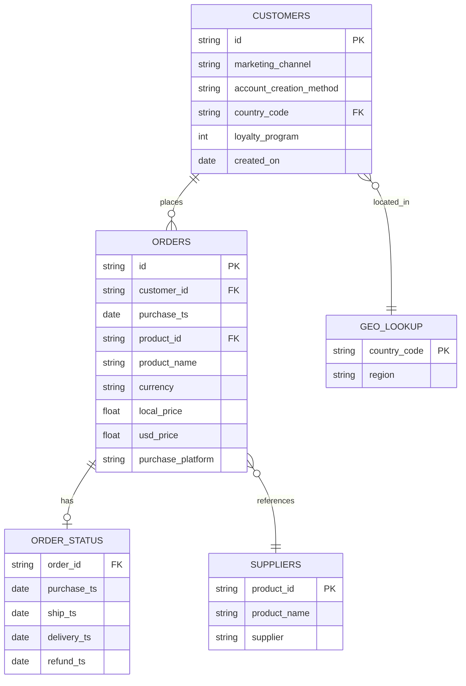

# E-Commerce Order Analysis: Seasonality, Product Performance & Customer Behavior

*A dual-tool analysis of e-commerce order data using Excel and SQL (BigQuery)*

This project analyzes e-commerce order data to answer both **exploratory, visual** business questions (seasonality, product mix, sales trends over time) and **precise, relational** questions that require joining across multiple tables (regional delivery performance, refund rates by SKU, loyalty program impact, cohort behavior).

Excel was used for trend analysis and visual reporting — pivot tables, growth-rate calculations, and conditional-formatting heatmaps. SQL (BigQuery) was used for the more complex, multi-table questions involving joins, window functions, and conditional aggregation. This mirrors how a real analytics workflow often blends both tools depending on the shape of the question being asked.

---

## Table of Contents

- [Business Questions](#business-questions)
- [Data](#data)
- [Entity Relationship Diagram](#entity-relationship-diagram)
- [Part 1: Excel Analysis — Seasonality & Product Performance](#part-1-excel-analysis--seasonality--product-performance)
- [Part 2: SQL Analysis — Regional, Delivery & Loyalty Insights](#part-2-sql-analysis--regional-delivery--loyalty-insights)
- [Combined Key Takeaways](#combined-key-takeaways)
- [Tools](#tools)
- [Next Steps](#next-steps)

---

## Business Questions

| # | Question | Tool |
|---|---|---|
| 1 | What seasonal sales patterns exist across 2019–2022? | Excel |
| 2 | Which products drive the most revenue vs. the most order volume? | Excel |
| 3 | What were the order counts, sales, and AOV for MacBooks sold in North America, by quarter, across all years? | SQL |
| 4 | For products purchased in 2022 on the website, or on mobile in any year, which region has the highest average delivery time? | SQL |
| 5 | What was the refund rate and refund count for each product overall? | SQL |
| 6 | Within each region, what is the most popular product? | SQL |
| 7 | How does time-to-first-purchase differ between loyalty and non-loyalty customers? | SQL |

## Data

The analysis draws on four related tables:

- **`core.orders`** — order-level records (product, price, purchase timestamp, customer ID)
- **`core.customers`** — customer records (signup date, loyalty program status, country code)
- **`core.order_status`** — fulfillment info (delivery timestamp, refund timestamp)
- **`core.geo_lookup`** — maps country codes to regions

The Excel analysis uses a cleaned, flattened version of this same order data (`orders_data_cleaned`), standardized for product naming and purchase-date consistency.

## Entity Relationship Diagram

---

## Part 1: Excel Analysis — Seasonality & Product Performance

**Method:** Built pivot tables from cleaned order data to summarize monthly sales by year, then layered in manual growth-rate formulas and conditional-formatting color scales to surface seasonal patterns and product-level performance.

### Seasonality

The data reveals a clear and repeatable seasonal pattern across 2020–2022. **February and October are consistently the two weakest months of the year**, averaging **-20.7%** and **-34.9%** month-over-month respectively. The October decline is worsening year over year — from -23.9% in 2020, to -25.7% in 2021, to -55.2% in 2022 — suggesting this isn't just a stable seasonal dip anymore but a trend worth investigating further.

**March is a reliable recovery month**, averaging **+21.1%** growth across the three years, largely offsetting the February slump. **November and December consistently close out the year strong**, averaging **+16.9%** and **+24.5%** — a clear holiday-driven sales lift present in every year of data. There's also a smaller, secondary dip in **June** (-5.4%, -4.8%, -10.8%), sitting between the early-year slump and the fall buildup.

Put together, the annual rhythm looks like: **strong Nov/Dec → sharp Jan/Feb drop → March rebound → gradual climb through summer → soft June → building toward a fall peak → steep October crash → recovery into the holidays again.**

The trend chart confirms this visually. **2020 and 2021 both show strong year-end acceleration**, climbing sharply from October into December. **2019 and 2022 sit well below 2020/2021 in total sales volume**, and while both still show the same October dip, neither recovers with the same strength going into year-end — 2022 in particular falls from roughly $400K in September to under $200K in October before only partially rebounding. **2020 stands out as the peak year**, closing near **$1.1M** in December — clearly ahead of every other year from September onward.

### Product Performance

The **27in 4K Gaming Monitor** is the top revenue driver — $9.85M (35% of total sales) from 23,408 orders (21.6% of order volume) — leading sales without leading volume, meaning it carries real pricing power in the mix. **Apple Airpods Headphones drive volume, not value** — 48,404 orders (44.8% of all orders) but only $7.74M (27.5% of sales) due to a low $159.90 AOV.

**Macbook Air and ThinkPad Laptop are high-value, low-volume anchors** — together just 6.4% of order count but 33.8% of total sales. These four products (Gaming Monitor, Airpods, Macbook Air, ThinkPad) make up **~96% of total revenue**, a strong signal that marketing and inventory focus should stay concentrated here rather than spread evenly across the catalog.

**Refund rate is a notable flag on laptops.** ThinkPad Laptop (12%) and Macbook Air (11%) have refund rates roughly double the 5% company-wide average — worth investigating given how much revenue rides on these two SKUs.

### Part 1 Recommendations

1. **Launch targeted promotions in February and October.** These months show a consistent, repeatable decline every year — a pattern worth planning around, not reacting to. Pilot a mid-tier discount or bundle offer in the next Feb/Oct cycle and measure whether the decline narrows.
2. **Lock in Q4 inventory and marketing budget by September, not October.** The sharp Oct crash right before the Nov/Dec surge means teams need to be prepared *ahead* of the dip.
3. **Investigate why 2022 underperformed 2020 and 2021.** Recommend a focused review of order volume vs. AOV, refund rates, and marketing spend changes specific to 2022.
4. **Prioritize marketing and inventory around the top 4 products**, which account for ~96% of revenue.
5. **Address the elevated refund rate on laptops** with a root-cause review (product quality, shipping damage, or expectation mismatch) given their outsized revenue impact.
6. **Explore a bundle offer for the Samsung Charging Cable Pack** — high order volume (20.3%) but minimal revenue share (1.6%) — to capture more value per transaction.

---

## Part 2: SQL Analysis — Regional, Delivery & Loyalty Insights

**Method:** Each business question was answered with a standalone SQL query (or set of queries) in Google BigQuery, using:

- **CTEs** (`WITH` clauses) to break multi-step logic into readable stages
- **Window functions** (`ROW_NUMBER() OVER (PARTITION BY ... ORDER BY ...)`) to rank and filter top values within groups
- **Conditional aggregation** (`CASE WHEN` inside `SUM`/`AVG`) to calculate rates like refund rate
- **Date functions** (`DATE_TRUNC`, `DATE_DIFF`, `EXTRACT`) for time-based and cohort-style analysis
- **Multi-table joins** (`LEFT JOIN`) across orders, customers, order status, and region lookup tables
- Basic data cleaning to standardize inconsistent product name formatting

The SQL scripts can be found [here](https://github.com/nlama002/ecom_analysis/blob/main/sql_analysis).

| # | Question | File |
|---|---|---|
| 1 | MacBook quarterly sales & AOV in North America | [`macbook_quarterly_sales_na.sql`](https://github.com/nlama002/ecom_analysis/blob/main/sql_analysis/macbook_quarterly_sales_na.sql) |
| 2 | Average delivery time by region (2022 website + all-year mobile) | [`avg_delivery_time_by_region.sql`](https://github.com/nlama002/ecom_analysis/blob/main/sql_analysis/avg_delivery_time_by_region.sql) |
| 3 | Refund rate and refund count by product | [`refund_rate_by_product.sql`](https://github.com/nlama002/ecom_analysis/blob/main/sql_analysis/refund_rate_by_product.sql) |
| 4 | Most popular product per region | [`top_product_by_region.sql`](https://github.com/nlama002/ecom_analysis/blob/main/sql_analysis/top_product_by_region.sql) |
| 5 | Time to first purchase: loyalty vs. non-loyalty customers | [`purchase_time_loyalty_vs_nonloyalty.sql`](https://github.com/nlama002/ecom_analysis/blob/main/sql_analysis/purchase_time_loyalty_vs_nonloyalty.sql) |

### Key Findings

**1. Demand is contracting, sharply, post-pandemic.**
MacBook orders in North America spiked 4–6x during 2020 (COVID pull-forward) and have declined nearly every quarter since — landing at 30 orders in Q4 2022, below pre-pandemic 2019 levels. AOV stayed flat ($1,433–$1,696) throughout, so this is a pure volume story, not a pricing one. If this pattern extends beyond MacBooks, it points to a broader post-COVID demand cliff across electronics.

**2. Operational metrics (delivery) are uniform — not a lever.**
Delivery time is essentially identical across all regions (7.51–7.53 days), ruling out delivery/logistics as a differentiator or pain point in this dataset.

**3. Refunds cluster hard around laptops.**
Laptops (ThinkPad, MacBook Air) refund at ~11–12%, roughly double every other product category. Low-cost accessories are barely refunded at all — this is the sharpest, most actionable signal in the entire dataset (and it independently corroborates the same finding from the Excel product-performance analysis in Part 1).

**4. One product dominates demand everywhere.**
AirPods are the #1 product in every region, by a wide margin. Region explains volume (EMEA/NA far outpace APAC/LATAM) but not preference — everyone wants the same thing. The more interesting question going forward is what's #2/#3 per region, since the top spot doesn't differentiate customer segments.

**5. Loyalty program has a real but small effect.**
Loyalty members purchase ~2.3 days faster than non-members (104.4 vs. 106.7 days) — directionally supports the program's value, but it's a modest nudge rather than a strong behavioral driver.

**Cross-cutting theme:** Region shows up throughout these queries (delivery, product popularity) but isn't actually where the interesting variation lives — it's flat or dominated by one SKU everywhere. The two threads worth pulling next are the laptop refund problem and whether the MacBook demand decline is category-wide, since those are the only two places the data shows real, decision-relevant movement.

### Part 2 Recommendations

1. **Investigate the laptop refund problem (highest priority).** Recommend a root-cause review at the SKU/batch level — check for a specific defect, a listing spec mismatch, or a shipping-damage pattern.
2. **Confirm whether the MacBook decline is product-specific or category-wide** by pulling the same quarterly trend for other high-ticket electronics before adjusting 2023 purchasing/marketing spend.
3. **Don't invest further in regional delivery optimization** — deprioritize in favor of higher-impact areas given the flat 7.5-day pattern across all regions.
4. **Look past the #1 product when segmenting by region** — re-run the popularity analysis for ranks #2–#5 per region to find where real customer preference diverges.
5. **Measure loyalty program impact beyond days-to-purchase** — check order frequency, AOV, and repeat-purchase rate by loyalty status for a fuller ROI read.
6. **Clean up null segments before drawing conclusions** — quantify the % of records with null region/loyalty values and either backfill or explicitly flag them.

---

## Combined Key Takeaways

Bringing both analyses together, two findings stand out as the highest-priority, cross-validated signals in this dataset:

- **Laptop refund rates are a confirmed, urgent problem.** Both the Excel product-performance table and the independent SQL refund-rate query arrive at the same number (~11–12% for ThinkPad and MacBook Air, roughly double every other product category) using two different tools and two different data-processing paths — strong evidence this is a real pattern, not an artifact of one method.
- **2022/post-2020 demand softness needs a category-wide investigation.** The Excel seasonality analysis shows 2022 underperforming 2020/2021 with a worsening October crash, and the SQL analysis independently shows MacBook orders in NA declining sharply since the 2020 pandemic-driven peak. Together, these suggest a broader post-2020 demand contraction rather than an isolated product or month-specific issue — worth a dedicated follow-up analysis before finalizing 2023 planning.

## Tools

- **Microsoft Excel** — pivot tables, growth-rate formulas, conditional-formatting heatmaps, chart visualization
- **SQL (Google BigQuery / GoogleSQL)** — CTEs, window functions, conditional aggregation, multi-table joins
- **Git / GitHub** — version control and portfolio hosting

## Next Steps

- Investigate root cause of laptop refund rates at the SKU/batch level
- Extend the MacBook demand-decline analysis to other high-ticket product categories
- Visualize the SQL findings (Tableau or Excel) to match the visual polish of Part 1
- Expand the business-question set as new stakeholder needs arise

---

*Part of an ongoing data analytics portfolio.*
